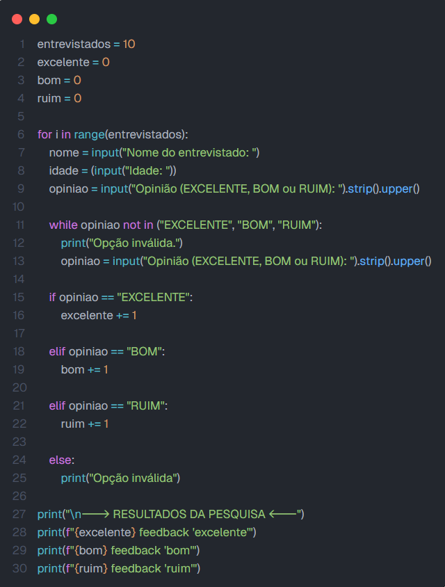
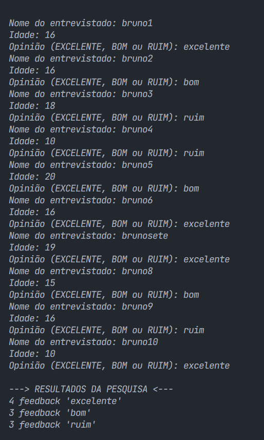

# 📊 Pesquisa de Opinião — Atendimento ao Cliente


Programa em Python que coleta e contabiliza o retorno de uma pesquisa de opinião sobre atendimento ao cliente, simulando uma demanda da empresa fictícia **TudoWeb**.

---

## 📋 Sobre o projeto

Projeto de atividade prática para **D.S., (ETEC)**, que aplica conceitos de **estruturas de repetição (`for`) e, para validação, (`while`), e estruturas de decisão (`if` / `elif` / `else`)**. O programa entrevista uma quantidade definida de pessoas (50), coleta nome, idade e opinião sobre o atendimento, e exibe ao final a contagem de respostas em cada categoria respectiva.

---

## ⚙️ Regras de classificação

| Opinião digitada | Contabilizada como |
|---|---|
| EXCELENTE | Feedback excelente |
| BOM | Feedback bom |
| RUIM | Feedback ruim |
| Qualquer outro valor | Rejeitada: usuário digita novamente |

---

## Como executar

```bash
python pesquisa_opiniao.py
```

Durante os testes, o número de entrevistados foi fixado em `10` (variável `entrevistados`),para a validação da atividade. Para a versão final, a variável é, então, `50`.

---

## 🖼️ Prints

**Código:**



**Execução no terminal:**



*Nota: se a opinião fosse inválida, o programa a pediria novamente e contabilizaria ela normalmente, mostrando-a ao final, no feedback geral.*

----

## 🛠️ Tecnologias e competências aplicadas


**Bruno Tanchela** 📌Desenvolvimento de Sistemas